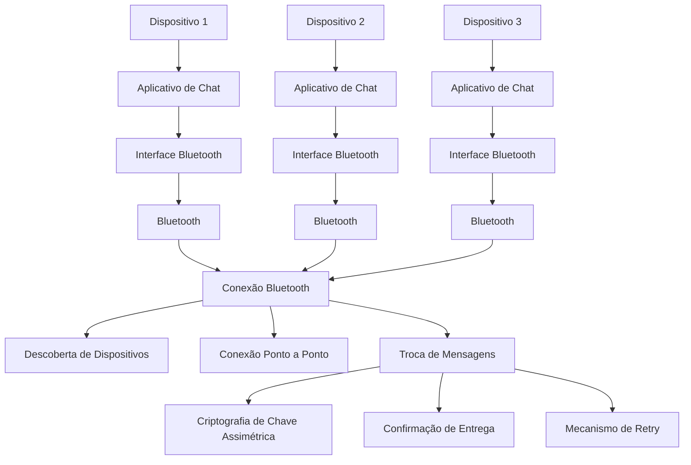

# Chat Bluetooth

Aqui estão os requisitos listados para o desenvolvimento do aplicativo de chat via Bluetooth:

## **Requisitos Funcionais**

1. **Comunicação via Bluetooth**: O aplicativo deve ser capaz de estabelecer conexões Bluetooth com outros dispositivos próximos.
2. **Rede de dispositivos**: Cada dispositivo com o aplicativo instalado deve atuar como um nó na rede, permitindo a entrega de mensagens entre dispositivos que não estão diretamente conectados.
3. **Entrega de mensagens**: O aplicativo deve ser capaz de entregar mensagens de um dispositivo para outro, passando por dispositivos intermediários se necessário.
4. **Confirmação de entrega**: O aplicativo deve fornecer uma confirmação de entrega quando a mensagem chegar ao destinatário, para evitar que outros dispositivos continuem tentando entregar a mensagem.
5. **Criptografia de chave assimétrica**: O aplicativo deve utilizar criptografia de chave assimétrica para garantir que somente o remetente e o destinatário possam ler o conteúdo das mensagens.
6. **Mecanismo de retry**: O aplicativo deve ter um mecanismo de retry para retransmitir mensagens que não foram entregues devido à falta de uma rota disponível.

## **Requisitos Não-Funcionais**

1. **Compatibilidade**: O aplicativo deve ser compatível com os sistemas operacionais Windows, Android, iOS e Mac.
2. **Segurança**: O aplicativo deve garantir a segurança das mensagens e dos dados dos usuários, utilizando criptografia e autenticação adequadas.
3. **Desempenho**: O aplicativo deve ter um desempenho razoável, mesmo em redes com muitos dispositivos e mensagens sendo transmitidas.

## **Requisitos de Usabilidade**

1. **Cadastro via convite**: O aplicativo deve permitir que os usuários se cadastrem apenas mediante convite de outro usuário já cadastrado.
2. **Dados pessoais**: O aplicativo deve coletar dados pessoais mínimos necessários para evitar contas falsas e garantir a segurança dos usuários.
3. **Interface amigável**: O aplicativo deve ter uma interface fácil de usar e intuitiva, permitindo que os usuários enviem e recebam mensagens de forma simples e segura.

## **Requisitos de Implementação**

1. **Desenvolvimento cross-platform**: O aplicativo deve ser desenvolvido utilizando uma estrutura que permita a criação de aplicativos nativos para várias plataformas a partir de um único código base (ex: Flutter).
2. **Bibliotecas e frameworks**: O aplicativo deve utilizar bibliotecas e frameworks adequados para lidar com a comunicação Bluetooth, criptografia e segurança.

Esses requisitos devem ser considerados durante o desenvolvimento do aplicativo para garantir que ele atenda às necessidades e expectativas dos usuários.

## Chat Bluetooth - Arquitetura de Soluções de Infraestrutura

### Explicação da arquitetura

- Cada dispositivo com o aplicativo de chat instalado possui uma interface Bluetooth que se conecta ao hardware Bluetooth do dispositivo.
- O aplicativo de chat utiliza a interface Bluetooth para se comunicar com o módulo Bluetooth do dispositivo.
- Quando os dispositivos estão próximos, eles estabelecem uma conexão Bluetooth entre si.
- Através da conexão Bluetooth, os dispositivos podem descobrir uns aos outros, estabelecer conexões ponto a ponto e trocar mensagens.
- Durante a troca de mensagens, o aplicativo implementa:
  - Criptografia de chave assimétrica para garantir a privacidade das mensagens.
  - Confirmação de entrega para notificar quando a mensagem chegar ao destinatário.
  - Mecanismo de retry para retransmitir mensagens não entregues.
- Caso não haja uma rota disponível para entregar a mensagem diretamente, o aplicativo pode utilizar outros dispositivos com o app instalado como nós intermediários para encaminhar a mensagem até o destinatário final.

Essa arquitetura permite que os dispositivos com o aplicativo de chat instalado troquem mensagens de forma segura e eficiente, utilizando apenas a conexão Bluetooth, sem a necessidade de acesso à internet.

## Padrões do Projeto

Para o desenvolvimento do aplicativo de chat via Bluetooth, utilizando Flutter, uma boa abordagem de design de software é seguir o padrão de arquitetura Model-View-Controller (MVC) ou Model-View-Presenter (MVP). Esses padrões de arquitetura separam a lógica da aplicação em diferentes camadas, facilitando a manutenção, testabilidade e escalabilidade do código.

Aqui está uma proposta de como você pode estruturar o design de software do seu projeto:

### Model

A camada Model é responsável por representar os dados e a lógica de negócios da aplicação. Nesse caso, você pode ter classes como:

- `Message`: representa uma mensagem, contendo informações como remetente, destinatário, conteúdo, data de envio, etc.
- `User`: representa um usuário do aplicativo, com informações como nome, email, avatar, etc.

### View

A camada View é responsável pela interface do usuário e pela interação com o usuário. Nesse caso, você pode ter widgets Flutter como:

- `ChatScreen`: exibe a lista de mensagens trocadas em um chat.
- `MessageWidget`: exibe uma única mensagem.
- `UserProfileScreen`: exibe informações do perfil do usuário.

### Controller/Presenter

A camada Controller ou Presenter é responsável por coordenar a interação entre a View e o Model. Nesse caso, você pode ter classes como:

- `ChatController`: responsável por gerenciar o estado do chat, enviar e receber mensagens via Bluetooth.
- `UserController`: responsável por gerenciar informações do usuário, como autenticação e cadastro.

### Serviços

Você também pode ter uma camada de serviços, responsável por encapsular a lógica de comunicação Bluetooth e criptografia. Nesse caso, você pode ter classes como:

- `BluetoothService`: responsável por gerenciar a conexão Bluetooth, descoberta de dispositivos e troca de mensagens.
- `CryptographyService`: responsável por implementar a criptografia de chave assimétrica para as mensagens.

Seguindo essa estrutura de design de software, você pode organizar seu código de forma modular e escalável, facilitando a manutenção e a adição de novas funcionalidades no futuro.
