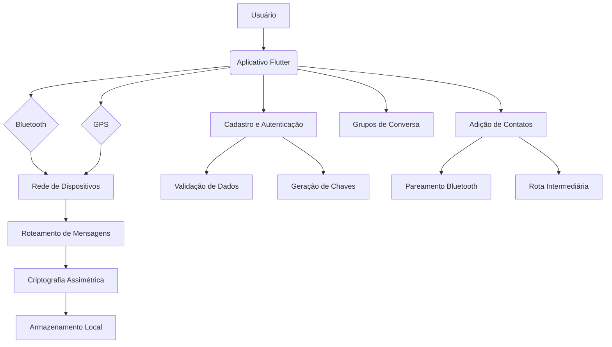
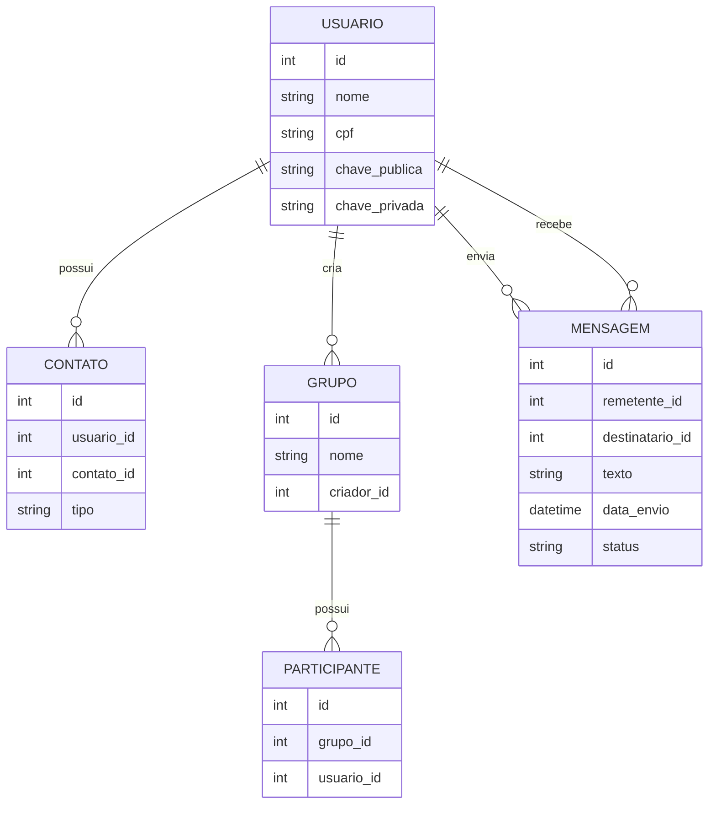

## Introdução

O objetivo deste projeto é desenvolver um aplicativo de mensagens que não dependa de acesso à internet, proporcionando uma comunicação segura e acessível a um público amplo, inclusive àqueles sem acesso à internet. A proposta é utilizar tecnologias como Bluetooth e GPS para criar uma rede descentralizada de dispositivos, onde cada usuário atua como receptor, remetente e servidor, permitindo o tráfego de mensagens de forma autônoma e sem a necessidade de uma infraestrutura centralizada.

## Requisitos

### Funcionalidades Principais

1. **Comunicação sem internet**: O aplicativo deve permitir o envio e recebimento de mensagens entre usuários sem a necessidade de acesso à internet.
2. **Segurança e Privacidade**: A comunicação deve ser criptografada de ponta a ponta, utilizando criptografia assimétrica com chave pública e privada, garantindo a confidencialidade das mensagens.
3. **Cadastro e Autenticação**: O cadastro de novos usuários deve ser feito através da internet, com a validação de dados pessoais (como CPF) para evitar a criação de contas falsas.
4. **Roteamento de Mensagens**: O aplicativo deve utilizar a rede de dispositivos dos usuários, juntamente com o sinal de GPS, para traçar a rota mais curta e eficiente para o envio de mensagens entre dispositivos.
5. **Grupos de Conversa**: Deve ser possível a criação de grupos de conversa, permitindo a comunicação entre múltiplos usuários.
6. **Adição de Contatos**: Os usuários devem poder adicionar contatos próximos através de pareamento Bluetooth, bem como contatos distantes, acessados via rota intermediária.

### Requisitos Técnicos

1. **Plataformas Compatíveis**: O aplicativo deve ser desenvolvido utilizando a tecnologia Flutter, permitindo a compatibilidade com múltiplas plataformas (Android, iOS, Web).
2. **Armazenamento de Histórico**: O histórico de conversas deve ser armazenado localmente em cada dispositivo, sem a necessidade de um servidor central.
3. **Processamento Distribuído**: O aplicativo deve gerenciar o processamento de dados de forma distribuída entre os dispositivos, evitando sobrecarregar qualquer dispositivo individual.
4. **Bluetooth e GPS**: O aplicativo deve utilizar as tecnologias de Bluetooth e GPS para a comunicação entre dispositivos e o traçado de rotas.
5. **Criptografia Assimétrica**: A comunicação deve ser criptografada de ponta a ponta, utilizando criptografia assimétrica com chave pública e privada.

## Soluções Propostas

1. **Comunicação sem internet**: Utilizar o Bluetooth e o sinal de GPS para criar uma rede descentralizada de dispositivos, onde cada usuário atua como receptor, remetente e servidor, permitindo o tráfego de mensagens sem a necessidade de acesso à internet.

2. **Segurança e Privacidade**: Implementar criptografia assimétrica com chave pública e privada, garantindo a confidencialidade das mensagens. Cada dispositivo deve gerar suas próprias chaves, sem a necessidade de um servidor central.

3. **Cadastro e Autenticação**: O cadastro de novos usuários deve ser feito através da internet, com a validação de dados pessoais (como CPF) para evitar a criação de contas falsas. Após o cadastro, o aplicativo pode funcionar offline.

4. **Roteamento de Mensagens**: Utilizar a rede de dispositivos dos usuários, juntamente com o sinal de GPS, para traçar a rota mais curta e eficiente para o envio de mensagens entre dispositivos. Implementar uma estrutura de grafo, onde cada dispositivo é um nó, para otimizar o roteamento.

5. **Grupos de Conversa**: Permitir a criação de grupos de conversa, onde as mensagens são transmitidas de dispositivo em dispositivo até atingirem todos os membros do grupo.

6. **Adição de Contatos**: Permitir a adição de contatos próximos através de pareamento Bluetooth, bem como a adição de contatos distantes, acessados via rota intermediária.

## Possíveis Problemas e Desafios

1. **Processamento Distribuído**: Garantir que o processamento de dados seja distribuído de forma equilibrada entre os dispositivos, evitando sobrecarregar qualquer dispositivo individual.

2. **Disponibilidade de Dispositivos**: Depender da disponibilidade de outros dispositivos na rede para o tráfego de mensagens pode ser um desafio, especialmente em áreas com baixa densidade populacional.

3. **Latência de Entrega**: O tempo de entrega das mensagens pode ser maior do que em aplicativos que utilizam a internet, devido à necessidade de traçar rotas entre dispositivos.

4. **Escalabilidade**: À medida que o número de usuários aumenta, pode ser um desafio manter a eficiência do roteamento e a distribuição de carga entre os dispositivos.

5. **Segurança Adicional**: Embora a criptografia assimétrica garanta a confidencialidade das mensagens, pode ser necessário implementar medidas adicionais de segurança, como autenticação de dispositivos e prevenção de ataques de negação de serviço.

Esses desafios devem ser cuidadosamente considerados durante o desenvolvimento do aplicativo, a fim de garantir uma solução robusta, escalável e segura.

## Infraestrutura

Aqui está um diagrama de infraestrutura simplificado para o aplicativo de mensagens proposto, levando em consideração os requisitos levantados:



Explicação do diagrama:

- O usuário interage com o aplicativo Flutter desenvolvido usando a tecnologia Flutter.
- O aplicativo utiliza o Bluetooth e o GPS do dispositivo para se conectar à rede de dispositivos.
- Cada dispositivo na rede atua como receptor, remetente e servidor, formando uma rede descentralizada.
- O roteamento de mensagens é feito através dessa rede de dispositivos, utilizando o sinal de GPS para traçar a rota mais curta.
- As mensagens são criptografadas de ponta a ponta usando criptografia assimétrica com chave pública e privada.
- O histórico de conversas é armazenado localmente em cada dispositivo.
- O cadastro de novos usuários é feito através da internet, com validação de dados pessoais (como CPF) para evitar contas falsas.
- Cada dispositivo gera suas próprias chaves públicas e privadas durante o cadastro.
- O aplicativo permite a criação de grupos de conversa.
- A adição de contatos pode ser feita por pareamento Bluetooth (para contatos próximos) ou por rota intermediária (para contatos distantes).

Esse diagrama ilustra a infraestrutura geral do aplicativo, mostrando como as diferentes tecnologias e funcionalidades se integram para criar uma solução de mensagens segura e independente de internet.

## Modelo Entidade Relacionamento

Aqui está um diagrama de entidade-relacionamento (DER) simplificado para o aplicativo de mensagens proposto, com base nos requisitos e no diagrama de infraestrutura apresentados anteriormente:



Entidades:

1. **USUARIO**: Representa cada usuário do aplicativo, com informações como nome, CPF, chave pública e chave privada.

2. **CONTATO**: Armazena os contatos de cada usuário, incluindo o tipo de contato (próximo ou distante).

3. **GRUPO**: Representa os grupos de conversa, com informações sobre o nome do grupo e o usuário que o criou.

4. **PARTICIPANTE**: Associa os usuários aos grupos dos quais fazem parte.

5. **MENSAGEM**: Guarda as informações sobre cada mensagem enviada, incluindo o remetente, destinatário, texto, data de envio e status da mensagem.

Relacionamentos:

- Um usuário pode possuir vários contatos (relação 1:N).
- Um usuário pode criar vários grupos (relação 1:N).
- Um grupo pode ter vários participantes (relação 1:N).
- Um usuário pode enviar várias mensagens (relação 1:N).
- Um usuário pode receber várias mensagens (relação 1:N).

Esse DER fornece uma visão geral das entidades e seus relacionamentos necessários para implementar as funcionalidades do aplicativo de mensagens, como gerenciamento de usuários, contatos, grupos e mensagens.

## Casos de Uso

Aqui está um diagrama de casos de uso baseado no projeto do aplicativo de mensagens proposto:

```mermaid
@startuml
left to right direction
actor Usuario as U
rectangle "Aplicativo de Mensagens" {
  U --> (Enviar Mensagem)
  U --> (Receber Mensagem)
  U --> (Criar Grupo)
  U --> (Adicionar Contato)
  U --> (Visualizar Mensagens)
  (Enviar Mensagem) --> (Criptografar Mensagem)
  (Receber Mensagem) --> (Descriptografar Mensagem)
  (Criar Grupo) --> (Adicionar Participante)
  (Criar Grupo) --> (Enviar Mensagem em Grupo)
  (Adicionar Contato) --> (Parear Dispositivos)
  (Adicionar Contato) --> (Adicionar Contato Distante)
}
@enduml
```

Explicação dos principais casos de uso:

1. **Enviar Mensagem**: Permite que o usuário envie uma mensagem para outro usuário ou grupo.
2. **Receber Mensagem**: Permite que o usuário receba e visualize mensagens recebidas.
3. **Criar Grupo**: Permite que o usuário crie um grupo de conversa e adicione participantes.
4. **Adicionar Contato**: Permite que o usuário adicione novos contatos, seja por pareamento de dispositivos ou por adição de contatos distantes.
5. **Visualizar Mensagens**: Permite que o usuário acesse e visualize o histórico de mensagens trocadas.

Esses casos de uso representam as principais interações que um usuário terá com o aplicativo de mensagens, desde o envio e recebimento de mensagens até a criação de grupos e adição de contatos.

